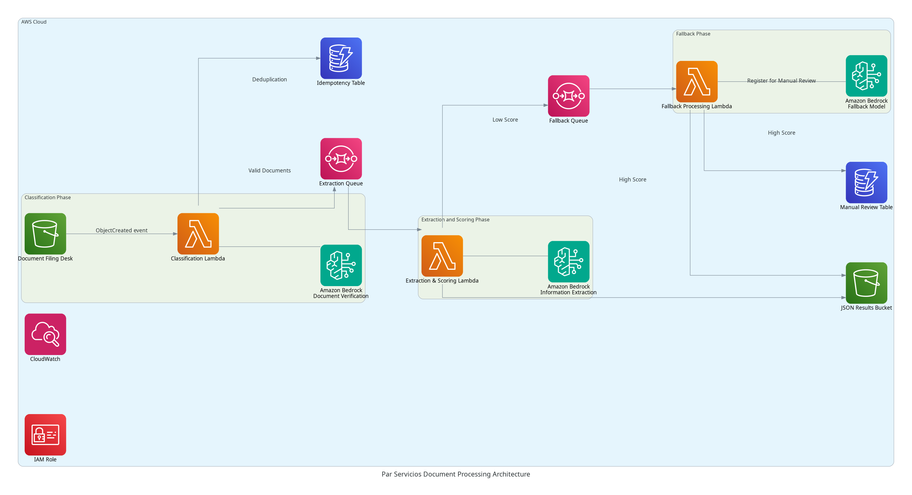
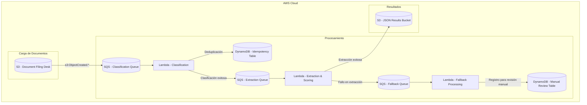
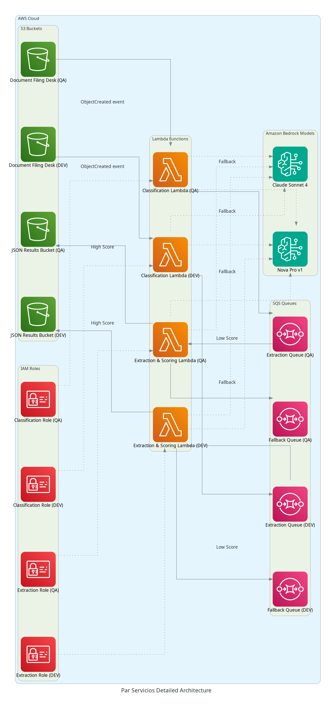
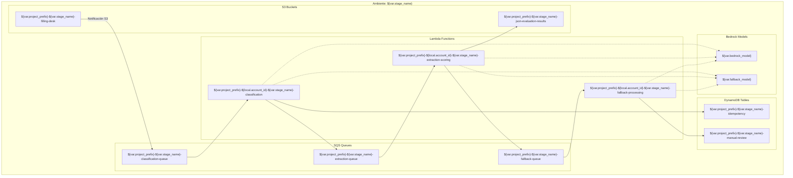

# Arquitectura AWS: Procesamiento de Documentos Par Servicios con Amazon Bedrock (V2)

## Introducción

Este documento presenta la arquitectura consolidada del sistema de procesamiento de documentos Par Servicios utilizando servicios serverless de AWS y Amazon Bedrock. Esta versión de la arquitectura incorpora mejoras en el flujo de procesamiento y la gestión de la idempotencia y revisión manual.

## Contenido

1. [**Visión General**](#visión-general) - Descripción general del sistema y sus componentes
2. [**Diagrama de Arquitectura**](#diagrama-de-arquitectura) - Representación visual del flujo de trabajo y componentes
3. [**Arquitectura Detallada**](#arquitectura-detallada) - Documentación completa con detalles específicos de cada ambiente
4. [**Flujo de Proceso**](#flujo-de-proceso) - Descripción detallada del flujo de procesamiento de documentos
5. [**Componentes del Sistema**](#componentes-del-sistema) - Descripción de cada componente y su propósito
6. [**Configuración de Ambientes**](#configuración-de-ambientes) - Información específica de los ambientes DEV y QA
7. [**Consideraciones de Seguridad**](#consideraciones-de-seguridad) - Aspectos de seguridad implementados

## Visión General

El sistema de procesamiento de documentos Par Servicios es una arquitectura serverless basada en eventos construida en AWS que procesa diferentes tipos de documentos empresariales. El sistema extrae información estructurada de estos documentos utilizando modelos de IA de Amazon Bedrock y almacena los resultados en formato JSON.

### Tipos de Documentos

| Tipo de Documento | Descripción |
|------------------|-------------|
| CERL | Certificados de Existencia y Representación Legal |
| CECRL | Copia de cédulas de ciudadanía del Representante Legal |
| RUT | Registro Único Tributario |
| RUB | Registro Único de Beneficiarios |
| ACC | Composiciones Accionarias |

### Componentes Principales

1. **Buckets S3**
   - Document Filing Desk: Punto de entrada para el procesamiento de documentos
   - JSON Results: Almacenamiento para los resultados de extracción

2. **Funciones Lambda**
   - Clasificación: Verifica y categoriza documentos
   - Extracción y Puntuación: Extrae información de los documentos
   - Procesamiento de Respaldo: Procesa extracciones fallidas y registra para revisión manual

3. **Colas SQS**
   - Cola de Clasificación: Recibe eventos de S3 y dispara la Lambda de Clasificación.
   - Cola de Extracción: Pasa mensajes de clasificación a extracción
   - Cola de Respaldo: Maneja documentos que requieren procesamiento adicional

4. **Servicios de IA/ML**
   - Amazon Bedrock: Modelos primario y de respaldo para comprensión de documentos

5. **Tablas DynamoDB**
   - Idempotency Table: Para asegurar el procesamiento exactamente una vez.
   - Manual Review Table: Para el seguimiento de documentos que requieren revisión manual.

### Ambientes

La arquitectura se despliega en dos ambientes:

| Ambiente | Propósito | Prefijo de Recursos |
|----------|-----------|-------------------|
| DEV | Desarrollo y pruebas | par-servicios-poc-dev |
| QA | Aseguramiento de calidad y validación | par-servicios-poc-qa |

## Diagrama de Arquitectura

### Arquitectura de Alto Nivel

El siguiente diagrama muestra la arquitectura de alto nivel del sistema de procesamiento de documentos Par Servicios:



Aquí se explica el diagrama para entender el flujo a alto nivel.


### Componentes del Diagrama

#### 1. Document Filing Desk (Bucket S3)
- **Propósito**: Punto de entrada para el procesamiento de documentos
- **Estructura**:
  ```
  s3://par-servicios-poc-[env]-filling-desk/
  ├── par-servicios-poc/CERL/     # Certificados de Existencia y Representación Legal
  ├── par-servicios-poc/CECRL/    # Copia de cédulas de ciudadadanía del Representante Legal
  ├── par-servicios-poc/RUT/      # Registro Único Tributario
  ├── par-servicios-poc/RUB/      # Registro Único de Beneficiarios
  └── par-servicios-poc/ACC/      # Composiciones Accionarias
  ```

#### 2. SQS Classification Queue
- **Propósito**: Recibe eventos de creación de objetos de S3 y los encola para procesamiento asíncrono.

#### 3. Classification Lambda
- **Propósito**: Verifica y categoriza documentos. Utiliza la tabla de idempotencia para asegurar el procesamiento una única vez.
- **Disparador**: Mensajes de la Cola de Clasificación SQS.
- **Proceso**: Verifica si los documentos no están vacíos, asigna puntuación inicial y realiza deduplicación.
- **Salida**: Envía mensaje a la Cola de Extracción SQS si la clasificación es exitosa.

#### 4. Idempotency Table (DynamoDB)
- **Propósito**: Almacena el estado de procesamiento para garantizar que cada documento se procese exactamente una vez, evitando duplicados.

#### 5. SQS Extraction Queue
- **Propósito**: Pasa mensajes de clasificación exitosa a la fase de extracción.

#### 6. Extraction & Scoring Lambda
- **Propósito**: Extrae información estructurada de los documentos utilizando modelos de Amazon Bedrock y asigna una puntuación de confianza.
- **Disparador**: Mensajes de la Cola de Extracción SQS.
- **Proceso**: Utiliza modelos de Amazon Bedrock para extraer datos.
- **Salida**:
  - Puntuación alta: Guarda resultados JSON en el bucket S3 de Resultados JSON.
  - Puntuación baja: Envía a la Cola de Respaldo SQS.

#### 7. SQS Fallback Queue
- **Propósito**: Maneja documentos con extracciones de baja confianza que requieren procesamiento adicional.

#### 8. Fallback Processing Lambda
- **Propósito**: Procesa documentos con baja confianza de extracción y registra los casos para revisión manual.
- **Disparador**: Mensajes de la Cola de Respaldo SQS.
- **Proceso**: Intenta reprocesar el documento con modelos alternativos de Bedrock. Si la extracción sigue siendo de baja confianza, registra el caso en la tabla de revisión manual.

#### 9. Manual Review Table (DynamoDB)
- **Propósito**: Almacena información sobre documentos que requieren revisión manual debido a fallos o baja confianza en la extracción.

#### 10. JSON Results Bucket (S3)
- **Propósito**: Almacena los resultados de extracción exitosos en formato JSON.
- **Estructura**: Misma estructura de carpetas que el bucket Filing Desk.

## Arquitectura Detallada

El siguiente diagrama muestra la arquitectura detallada del sistema, incluyendo los recursos específicos de cada ambiente:





### Estructura de Carpetas
Ambos ambientes mantienen la misma estructura de carpetas en los buckets S3:
```
par-servicios-poc/CERL/     # Certificados de Existencia y Representación Legal
par-servicios-poc/CECRL/    # Copia de cédulas de ciudadadanía del Representante Legal
par-servicios-poc/RUT/      # Registro Único Tributario
par-servicios-poc/RUB/      # Registro Único de Beneficiarios
└── par-servicios-poc/ACC/      # Composiciones Accionarias
```

### Modelos de Amazon Bedrock
- **Modelo Principal**: `us.amazon.nova-pro-v1:0` (configurable via `bedrock_model` variable)
- **Modelo de Respaldo**: `us.anthropic.claude-sonnet-4-20250514-v1:0` (configurable via `fallback_model` variable)

## Flujo de Proceso

1. **Carga de Documentos**:
   - Los documentos se cargan en el bucket S3 `filling-desk` en la carpeta apropiada según el tipo de documento.

2. **Notificación S3 y Encolamiento**:
   - Los eventos `s3:ObjectCreated:*` en el bucket `filling-desk` disparan una notificación a la `classification-queue` de SQS.

3. **Clasificación y Deduplicación**:
   - La función Lambda `classification` procesa los mensajes de la `classification-queue`.
   - Utiliza la `idempotency-table` para asegurar que cada documento se procese una única vez.
   - Verifica el documento y asigna una puntuación inicial.
   - Los documentos válidos generan un mensaje enviado a la `extraction-queue` de SQS.

4. **Extracción y Puntuación**:
   - La función Lambda `extraction-scoring` procesa los mensajes de la `extraction-queue`.
   - Utiliza modelos de Amazon Bedrock (principal y de respaldo) para extraer información basada en el tipo de documento.
   - Los resultados con alta puntuación se guardan directamente en el bucket S3 `json-evaluation-results`.
   - Los resultados con baja puntuación se envían a la `fallback-queue` para procesamiento adicional.

5. **Procesamiento de Respaldo y Registro de Revisión Manual**:
   - La función Lambda `fallback-processing` procesa los mensajes de la `fallback-queue`.
   - Intenta reprocesar el documento con modelos alternativos de Bedrock.
   - Si la extracción es exitosa, los resultados se guardan en el bucket S3 `json-evaluation-results`.
   - Si la extracción sigue siendo de baja confianza o falla, la información se registra en la `manual-review-table` de DynamoDB para su posterior revisión manual.

## Componentes del Sistema

### S3 Buckets
- **`par-servicios-poc-[env]-filling-desk`**: Bucket de entrada para los documentos PDF.
- **`par-servicios-poc-[env]-json-evaluation-results`**: Bucket de salida para los resultados JSON de la extracción.

### SQS Queues
- **`par-servicios-poc-[env]-classification-queue`**: Cola para eventos de S3 que disparan la clasificación.
- **`par-servicios-poc-[env]-extraction-queue`**: Cola para mensajes entre la clasificación y la extracción.
- **`par-servicios-poc-[env]-fallback-queue`**: Cola para mensajes de documentos que requieren procesamiento de respaldo.

### Lambda Functions
- **`par-servicios-poc-[account_id]-[env]-classification`**: Función Lambda para la clasificación de documentos.
- **`par-servicios-poc-[account_id]-[env]-extraction-scoring`**: Función Lambda para la extracción y puntuación de datos.
- **`par-servicios-poc-[account_id]-[env]-fallback-processing`**: Función Lambda para el procesamiento de respaldo y registro de revisión manual.

### DynamoDB Tables
- **`par-servicios-poc-[env]-idempotency`**: Tabla DynamoDB para la gestión de la idempotencia en el procesamiento de documentos.
- **`par-servicios-poc-[env]-manual-review`**: Tabla DynamoDB para el registro de documentos que requieren revisión manual.

### Amazon Bedrock Models
- **`bedrock_model`**: Modelo principal de Bedrock utilizado para la clasificación y extracción.
- **`fallback_model`**: Modelo de respaldo de Bedrock utilizado en caso de baja confianza o fallos del modelo principal.

## Configuración de Ambientes

La infraestructura se despliega en dos ambientes principales, `dev` y `qa`, con la siguiente configuración:

| Parámetro | Ambiente DEV | Ambiente QA |
|-----------|-------------|------------|
| Prefijo completo | `par-servicios-poc-dev` | `par-servicios-poc-qa` |
| Región AWS | `us-east-2` (Ohio) | `us-east-2` (Ohio) |
| Modelo Bedrock principal | `us.amazon.nova-pro-v1:0` | `us.amazon.nova-pro-v1:0` |
| Modelo Bedrock respaldo | `us.anthropic.claude-sonnet-4-20250514-v1:0` | `us.anthropic.claude-sonnet-4-20250514-v1:0` |

## Consideraciones de Seguridad

- **Encriptación en reposo**: Todos los buckets S3 y colas SQS tienen encriptación en reposo habilitada (SSE-S3 para S3, SSE-SQS para SQS).
- **Políticas IAM**: Los roles IAM siguen el principio de mínimo privilegio, con permisos específicos para cada función Lambda.
- **Acceso público**: El acceso público a los buckets S3 está bloqueado.
- **Idempotencia**: La tabla de idempotencia de DynamoDB ayuda a prevenir el procesamiento duplicado de documentos, lo que puede tener implicaciones de seguridad y consistencia de datos.
- **Registro de revisión manual**: La tabla de revisión manual permite un seguimiento claro de los documentos que no pudieron ser procesados automáticamente, facilitando la auditoría y la corrección de errores.