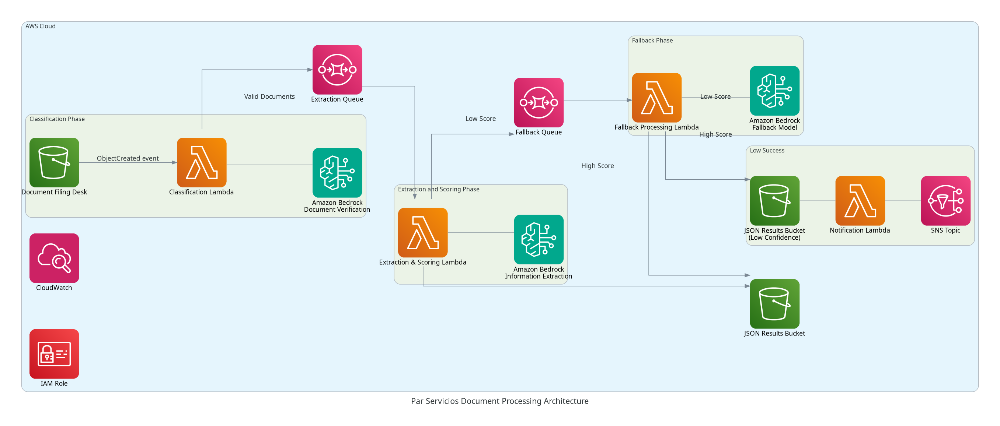
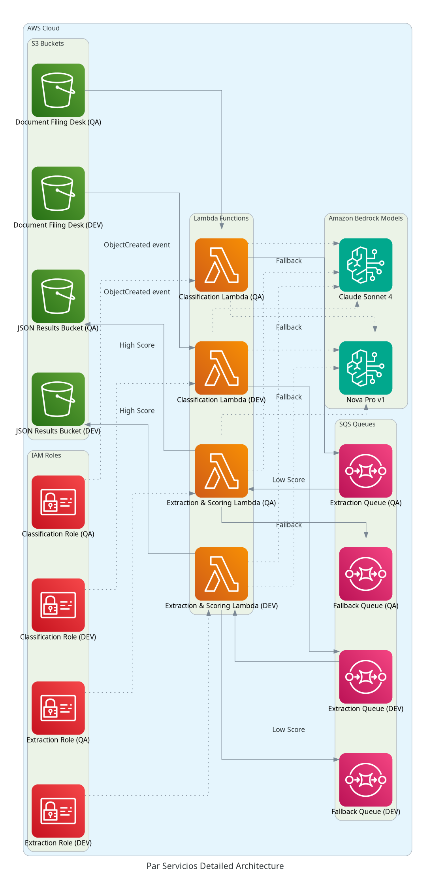

# Arquitectura AWS: Procesamiento de Documentos Par Servicios con Amazon Bedrock

## Introducción

Este documento presenta la arquitectura consolidada del sistema de procesamiento de documentos Par Servicios utilizando servicios serverless de AWS y Amazon Bedrock. El sistema está diseñado para procesar diferentes tipos de documentos utilizando modelos de IA y almacenar los resultados en formato JSON.

## Contenido

1. [**Visión General**](#visión-general) - Descripción general del sistema y sus componentes
2. [**Diagrama de Arquitectura**](#diagrama-de-arquitectura) - Representación visual del flujo de trabajo y componentes
3. [**Arquitectura Detallada**](#arquitectura-detallada) - Documentación completa con detalles específicos de cada ambiente
4. [**Flujo de Proceso**](#flujo-de-proceso) - Descripción detallada del flujo de procesamiento de documentos
5. [**Componentes del Sistema**](#componentes-del-sistema) - Descripción de cada componente y su propósito
6. [**Configuración de Ambientes**](#configuración-de-ambientes) - Información específica de los ambientes DEV y QA
7. [**Consideraciones de Seguridad**](#consideraciones-de-seguridad) - Aspectos de seguridad implementados

## Visión General

El sistema de procesamiento de documentos Par Servicios es una arquitectura serverless basada en eventos construida en AWS que procesa diferentes tipos de documentos empresariales. El sistema extrae información estructurada de estos documentos utilizando modelos de IA de Amazon Bedrock y almacena los resultados en formato JSON.

### Tipos de Documentos

El sistema procesa cinco tipos de documentos:

| Tipo de Documento | Descripción |
|------------------|-------------|
| CERL | Certificados de Existencia y Representación Legal |
| CECRL | Copia de cédulas de ciudadanía del Representante Legal |
| RUT | Registro Único Tributario |
| RUB | Registro Único de Beneficiarios |
| ACC | Composiciones Accionarias |

### Componentes Principales

1. **Buckets S3**
   - Document Filing Desk: Punto de entrada para el procesamiento de documentos
   - JSON Results: Almacenamiento para los resultados de extracción

2. **Funciones Lambda**
   - Clasificación: Verifica y categoriza documentos
   - Extracción y Puntuación: Extrae información de los documentos
   - Procesamiento de Respaldo: Maneja extracciones de baja confianza
   - Notificación: Gestiona el proceso de revisión manual

3. **Colas SQS**
   - Cola de Extracción: Pasa mensajes de clasificación a extracción
   - Cola de Respaldo: Maneja documentos que requieren procesamiento adicional

4. **Servicios de IA/ML**
   - Amazon Bedrock: Modelos primario y de respaldo para comprensión de documentos

### Ambientes

La arquitectura se despliega en dos ambientes:

| Ambiente | Propósito | Prefijo de Recursos |
|----------|-----------|-------------------|
| DEV | Desarrollo y pruebas | par-servicios-poc-dev |
| QA | Aseguramiento de calidad y validación | par-servicios-poc-qa |

## Diagrama de Arquitectura

### Arquitectura de Alto Nivel

El siguiente diagrama muestra la arquitectura de alto nivel del sistema de procesamiento de documentos Par Servicios:



### Componentes del Diagrama

#### 1. Document Filing Desk (Bucket S3)
- **Propósito**: Punto de entrada para el procesamiento de documentos
- **Estructura**:
  ```
  s3://par-servicios-poc-[env]-filling-desk/
  ├── par-servicios-poc/CERL/     # Certificados de Existencia y Representación Legal
  ├── par-servicios-poc/CECRL/    # Copia de cédulas de ciudadadanía del Representante Legal
  ├── par-servicios-poc/RUT/      # Registro Único Tributario
  ├── par-servicios-poc/RUB/      # Registro Único de Beneficiarios
  └── par-servicios-poc/ACC/      # Composiciones Accionarias
  ```

#### 2. Fase de Clasificación
- **Función Lambda**: Verifica y categoriza documentos
- **Disparador**: Eventos S3 ObjectCreated
- **Proceso**: Verifica si los documentos no están vacíos, asigna puntuación inicial
- **Salida**: Envía mensaje a la Cola de Extracción SQS

#### 3. Fase de Extracción y Puntuación
- **Función Lambda**: Extrae información basada en el tipo de documento
- **Disparador**: Mensajes de la Cola de Extracción SQS
- **Proceso**: Utiliza modelos de Amazon Bedrock para extraer datos
- **Salida**:
  - Puntuación alta: Guarda resultados JSON en el bucket S3
  - Puntuación baja: Envía a la Cola de Respaldo SQS

#### 4. Fase de Respaldo
- **Función Lambda**: Reprocesa documentos utilizando modelos de Bedrock
- **Disparador**: Mensajes de la Cola de Respaldo SQS
- **Proceso**: Utiliza modelos alternativos de Bedrock
- **Salida**:
  - Éxito: Guarda en el bucket S3 de Resultados JSON
  - Fallo: Envía a Lambda de Notificación

#### 5. Bucket de Resultados JSON
- **Propósito**: Almacena resultados de extracción
- **Estructura**: Misma estructura de carpetas que el bucket Filing Desk

#### 6. Sistema de Notificación
- **Función Lambda**: Maneja extracciones fallidas
- **Proceso**: Guarda información y envía notificación
- **Salida**: Notificación SNS para revisión manual

## Arquitectura Detallada

El siguiente diagrama muestra la arquitectura detallada del sistema, incluyendo los recursos específicos de cada ambiente:




### Estructura de Carpetas
Ambos ambientes mantienen la misma estructura de carpetas en los buckets S3:
```
par-servicios-poc/CERL/     # Certificados de Existencia y Representación Legal
par-servicios-poc/CECRL/    # Copia de cédulas de ciudadadanía del Representante Legal
par-servicios-poc/RUT/      # Registro Único Tributario
par-servicios-poc/RUB/      # Registro Único de Beneficiarios
par-servicios-poc/ACC/      # Composiciones Accionarias
```

### Modelos de Amazon Bedrock
- **Modelo Principal**: us.amazon.nova-pro-v1:0
- **Modelo de Respaldo**: us.anthropic.claude-sonnet-4-20250514-v1:0

## Flujo de Proceso

1. **Carga de Documentos**:
   - Los documentos se cargan en el bucket S3 Filing Desk en la carpeta apropiada según el tipo de documento.

2. **Clasificación**:
   - Los eventos S3 ObjectCreated disparan la función Lambda de Clasificación.
   - La función verifica el documento y asigna una puntuación inicial.
   - Los documentos válidos generan un mensaje enviado a la Cola de Extracción SQS.

3. **Extracción y Puntuación**:
   - La función Lambda de Extracción procesa los mensajes de la Cola de Extracción.
   - Utiliza modelos de Amazon Bedrock para extraer información basada en el tipo de documento.
   - Los resultados con alta puntuación se guardan directamente en el bucket S3 de Resultados JSON.
   - Los resultados con baja puntuación se envían a la Cola de Respaldo para procesamiento adicional.

4. **Procesamiento de Respaldo**:
   - Para documentos con baja confianza de extracción, se realiza un procesamiento adicional.
   - Se utiliza el modelo de respaldo de Bedrock para intentar mejorar la extracción.
   - Las extracciones exitosas se guardan en el bucket de Resultados JSON.
   - Las extracciones fallidas disparan notificaciones para revisión manual.
