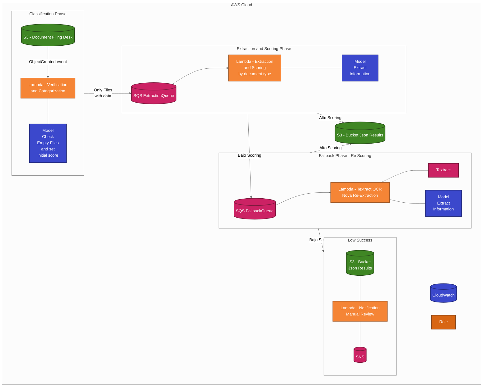

# AWS Architecture: Par Servicios Document Processing with Amazon Bedrock

This document presents the architecture diagram for the Par Servicios document processing system using AWS serverless services and Amazon Bedrock.

## Architecture Overview

The system processes different types of documents (CERL, CECRL, RUT, RUB, ACC) through a serverless event-driven architecture. Documents are uploaded to an S3 bucket, processed by Lambda functions using Amazon Bedrock models, and results are stored in another S3 bucket.



## Components Description

### 1. Document Filing Desk (S3 Bucket)
- **Purpose**: Entry point for document processing
- **Structure**:
  ```
  s3://par-servicios-poc-[env]-filling-desk/
  ├── par-servicios-poc/CERL/     # Certificados de Existencia y Representación Legal
  ├── par-servicios-poc/CECRL/    # Copia de cédulas de ciudadadanía del Representante Legal
  ├── par-servicios-poc/RUT/      # Registro Único Tributario
  ├── par-servicios-poc/RUB/      # Registro Único de Beneficiarios
  └── par-servicios-poc/ACC/      # Composiciones Accionarias
  ```

### 2. Classification Phase
- **Lambda Function**: Verifies and categorizes documents
- **Trigger**: S3 ObjectCreated events
- **Process**: Checks if documents are not empty, assigns initial score
- **Output**: Sends message to SQS Extraction Queue

### 3. Extraction and Scoring Phase
- **Lambda Function**: Extracts information based on document type
- **Trigger**: Messages from SQS Extraction Queue
- **Process**: Uses Amazon Bedrock models to extract data
- **Output**:
  - High score: Saves JSON results to S3 bucket
  - Low score: Sends to SQS Fallback Queue

### 4. Fallback Phase
- **Lambda Function**: Re-processes documents using Textract and Bedrock
- **Trigger**: Messages from SQS Fallback Queue
- **Process**: Uses Amazon Textract OCR and Bedrock models
- **Output**:
  - Success: Saves to S3 JSON Results bucket
  - Failure: Sends to Notification Lambda

### 5. JSON Results Bucket
- **Purpose**: Stores extraction results
- **Structure**: Same folder structure as Filing Desk bucket

### 6. Notification System
- **Lambda Function**: Handles failed extractions
- **Process**: Saves information and sends notification
- **Output**: SNS notification for manual review

## Environment Configuration

The architecture is deployed in two environments:

| Environment | Resource Prefix | Region |
|-------------|----------------|--------|
| DEV | par-servicios-poc-dev | us-east-2 |
| QA | par-servicios-poc-qa | us-east-2 |

## AWS Services Used

- **S3**: Document storage and results
- **Lambda**: Serverless compute for document processing
- **SQS**: Asynchronous message queuing
- **Amazon Bedrock**: AI models for document understanding
- **Amazon Textract**: OCR and document analysis
- **SNS**: Notifications for manual review
- **IAM**: Security and access control
- **CloudWatch**: Monitoring and logging
