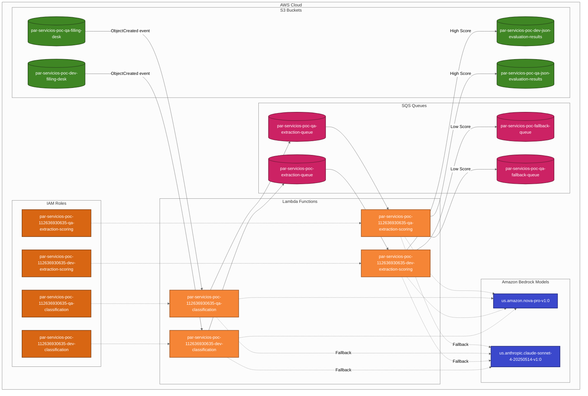

# Detailed AWS Architecture: Par Servicios Document Processing

This document provides a detailed architecture diagram and description of the Par Servicios document processing system implemented on AWS using serverless services and Amazon Bedrock.

## Detailed Architecture Diagram



## Environment-Specific Resources

### DEV Environment

#### S3 Buckets
- **Filing Desk**: `par-servicios-poc-dev-filling-desk`
  - ARN: `arn:aws:s3:::par-servicios-poc-dev-filling-desk`
- **JSON Results**: `par-servicios-poc-dev-json-evaluation-results`
  - ARN: `arn:aws:s3:::par-servicios-poc-dev-json-evaluation-results`

#### Lambda Functions
- **Classification**: `par-servicios-poc-112636930635-dev-classification`
  - ARN: `arn:aws:lambda:us-east-2:112636930635:function:par-servicios-poc-112636930635-dev-classification`
- **Extraction and Scoring**: `par-servicios-poc-112636930635-dev-extraction-scoring`
  - ARN: `arn:aws:lambda:us-east-2:112636930635:function:par-servicios-poc-112636930635-dev-extraction-scoring`

#### SQS Queues
- **Extraction Queue**: `par-servicios-poc-extraction-queue`
  - URL: `https://sqs.us-east-2.amazonaws.com/112636930635/par-servicios-poc-extraction-queue`
  - ARN: `arn:aws:sqs:us-east-2:112636930635:par-servicios-poc-extraction-queue`
- **Fallback Queue**: `par-servicios-poc-fallback-queue`
  - URL: `https://sqs.us-east-2.amazonaws.com/112636930635/par-servicios-poc-fallback-queue`
  - ARN: `arn:aws:sqs:us-east-2:112636930635:par-servicios-poc-fallback-queue`

#### IAM Roles
- **Classification**: `par-servicios-poc-112636930635-dev-classification`
  - ARN: `arn:aws:iam::112636930635:role/par-servicios-poc-112636930635-dev-classification`
- **Extraction and Scoring**: `par-servicios-poc-112636930635-dev-extraction-scoring`
  - ARN: `arn:aws:iam::112636930635:role/par-servicios-poc-112636930635-dev-extraction-scoring`

### QA Environment

#### S3 Buckets
- **Filing Desk**: `par-servicios-poc-qa-filling-desk`
  - ARN: `arn:aws:s3:::par-servicios-poc-qa-filling-desk`
- **JSON Results**: `par-servicios-poc-qa-json-evaluation-results`
  - ARN: `arn:aws:s3:::par-servicios-poc-qa-json-evaluation-results`

#### Lambda Functions
- **Classification**: `par-servicios-poc-112636930635-qa-classification`
  - ARN: `arn:aws:lambda:us-east-2:112636930635:function:par-servicios-poc-112636930635-qa-classification`
- **Extraction and Scoring**: `par-servicios-poc-112636930635-qa-extraction-scoring`
  - ARN: `arn:aws:lambda:us-east-2:112636930635:function:par-servicios-poc-112636930635-qa-extraction-scoring`

#### SQS Queues
- **Extraction Queue**: `par-servicios-poc-qa-extraction-queue`
  - URL: `https://sqs.us-east-2.amazonaws.com/112636930635/par-servicios-poc-qa-extraction-queue`
  - ARN: `arn:aws:sqs:us-east-2:112636930635:par-servicios-poc-qa-extraction-queue`
- **Fallback Queue**: `par-servicios-poc-qa-fallback-queue`
  - URL: `https://sqs.us-east-2.amazonaws.com/112636930635/par-servicios-poc-qa-fallback-queue`
  - ARN: `arn:aws:sqs:us-east-2:112636930635:par-servicios-poc-qa-fallback-queue`

#### IAM Roles
- **Classification**: `par-servicios-poc-112636930635-qa-classification`
  - ARN: `arn:aws:iam::112636930635:role/par-servicios-poc-112636930635-qa-classification`
- **Extraction and Scoring**: `par-servicios-poc-112636930635-qa-extraction-scoring`
  - ARN: `arn:aws:iam::112636930635:role/par-servicios-poc-112636930635-qa-extraction-scoring`

## Common Configuration

### Lambda Configuration
- **Runtime**: Python 3.12
- **Handler**: index.handler
- **Memory**: 1024 MB
- **Timeout**: 900 seconds

### S3 Bucket Configuration
- **Versioning**: Enabled
- **Encryption**: AES256 (SSE-S3)
- **Public Access**: Blocked

### SQS Queue Configuration
- **Timeout**: 960 seconds
- **Message Retention**: 345600 seconds (4 days)
- **Encryption**: SSE-SQS (AES-256)

### Folder Structure
Both environments maintain the same folder structure in S3 buckets:
```
par-servicios-poc/CERL/     # Certificados de Existencia y Representación Legal
par-servicios-poc/CECRL/    # Copia de cédulas de ciudadadanía del Representante Legal
par-servicios-poc/RUT/      # Registro Único Tributario
par-servicios-poc/RUB/      # Registro Único de Beneficiarios
par-servicios-poc/ACC/      # Composiciones Accionarias
```

### Amazon Bedrock Models
- **Primary Model**: us.amazon.nova-pro-v1:0
- **Fallback Model**: us.anthropic.claude-sonnet-4-20250514-v1:0

## Data Flow

1. **Document Upload**:
   - Documents are uploaded to the Filing Desk S3 bucket in the appropriate folder based on document type.

2. **Classification**:
   - S3 ObjectCreated events trigger the Classification Lambda function.
   - The function verifies the document and assigns an initial score.
   - Valid documents trigger a message sent to the Extraction SQS Queue.

3. **Extraction and Scoring**:
   - The Extraction Lambda function processes messages from the Extraction Queue.
   - It uses Amazon Bedrock models to extract information based on document type.
   - High-scoring results are saved directly to the JSON Results S3 bucket.
   - Low-scoring results are sent to the Fallback Queue for additional processing.

4. **Fallback Processing**:
   - For documents with low extraction confidence, additional processing is performed.
   - This may include using Amazon Textract for OCR and the fallback Bedrock model.
   - Successful extractions are saved to the JSON Results bucket.
   - Failed extractions trigger notifications for manual review.

## Security Considerations

- All S3 buckets have server-side encryption enabled (SSE-S3 with AES-256).
- SQS queues are encrypted using SSE-SQS (AES-256).
- IAM roles follow the principle of least privilege, with specific permissions for each function.
- Public access to S3 buckets is blocked.
- Lambda functions have appropriate timeout and memory configurations.

## Terraform Implementation

The infrastructure is defined as code using Terraform modules:
- SQS queues are created using the `terraform-aws-modules/sqs/aws` module
- Lambda functions are created using a custom `lambda-wrapper` module
- S3 buckets are created using a custom `s3` module
- Event mappings connect the components together

The Terraform code creates all necessary resources, configures permissions, and sets up event triggers to enable the serverless event-driven architecture.
