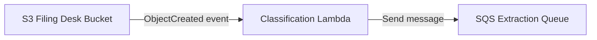
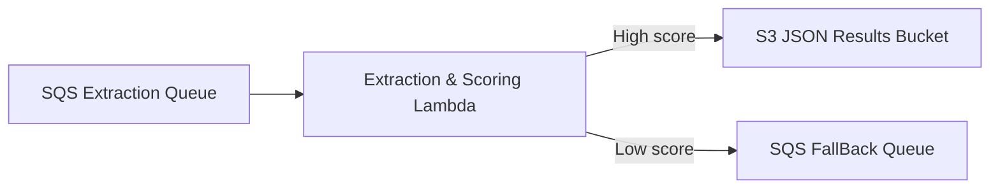
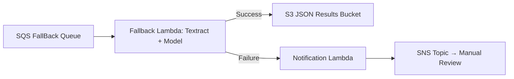

# Diagrama de Arquitectura: Agentes Bedrock Par Servicios

## 1. Punto de Entrada - Document Filing Desk

Bucket S3 que contendrá 5 folders según el tipo de docuemento, por lo que tendrá la siguiente estructura:


```bash
s3://par-servicios-filing-desk-bucket/
├── CERL/     # Certificados de Existencia y Representación Legal
├── CECRL/    # Copia de cédulas de ciudadadanía del Representante Legal
├── RUT/      # Registro Único Tributario
├── RUB/      # Registro Único de Beneficiarios
└── ACC/      # Composiciones Accionarias
```

## 2. Clasification Phase

Esta sección tendrá un lambda de verificación y categorización. 


Este lambda se ejecutará cuando se agregue un documento en el bucket anterior, revisará que no esté vacío, le dará una calificación inicial y luego a través del SQS Extraction Queue lo enviará a la siguiente fase.

Representación Mermaid:




## 3. Extraction and Scoring Phase

Este lambda extrae la información y obtiene la información según el tipo de documento.


De acuerdo a la evaluación, si el resultado de la extracción es alto, directamente guardará los resultados en un archivo json que se guardará en el Bucket Json Results que tendrá una estructura similar al bucket filing desk.

```
s3://par-servicios-json-evaluation-results-bucket/
├── CERL/     # Certificados de Existencia y Representación Legal
├── CECRL/    # Copia de cédulas de ciudadadanía del Representante Legal
├── RUT/      # Registro Único Tributario
├── RUB/      # Registro Único de Beneficiarios
└── ACC/      # Composiciones Accionarias
```

En caso el resultado sea bajo, se enviará a la fase de fallback, a través del SQS FallBackQueue.

Diagrama Mermaid:




## 4. Fallback Phase

Este lambda además del modelo se apoya en textract para leer nuevamente el documento y obtener información.


En este caso, si hay exito, lo enviará al bucket json results con nueva calificación. En caso exista algún problema, enviará la información al proceso lamdda de notificación. Se guardará la información en el mismo bucket y a través de SNS notificará a quien corresponda para que haga la revisión manual del proceso. 

Diagrama Mermaid: 



## 5. Buckets de Resultados

En los casos de éxito, se guardan los resultados en el bucket correspondiente, el cual mantiene la misma estructura de carpetas que el Filing Desk:

```
s3://par-servicios-json-evaluation-results-bucket/
├── CERL/
├── CECRL/
├── RUT/
├── RUB/
└── ACC/
```

> **Nota:** En caso de error persistente, la notificación por SNS permitirá una revisión manual y retroalimentación al modelo para mejorar su desempeño

